## System Architecture

```mermaid
graph TD
    %% User Interaction Flow
    START([User Opens Web Interface]) --> CONFIG[Configure AI Model<br/>OpenAI/Anthropic/Google/Local]
    CONFIG --> UPLOAD[Upload Java Codebase<br/>ZIP File]
    
    %% Session Creation Flow
    CONFIG --> CREATE_SESSION{Create Session<br/>with AI Provider}
    CREATE_SESSION -->|Success| SESSION_READY[Session Ready<br/>Unique Session ID]
    CREATE_SESSION -->|Failure| ERROR1[Show Error<br/>Invalid API Key]
    
    %% Upload Processing Flow
    UPLOAD --> VALIDATE{Validate ZIP File}
    VALIDATE -->|Invalid| ERROR2[Show Error<br/>Invalid File Type]
    VALIDATE -->|Valid| SAVE_FILE[Save to uploads/<br/>session_id_filename.zip]
    
    SAVE_FILE --> START_BG[Start Background<br/>Processing Task]
    START_BG --> WS_CONNECT[Establish WebSocket<br/>Connection for Progress]
    
    %% Background Processing Flow
    subgraph "Background Processing (Async)"
        CLEAR_CTX[Clear Previous<br/>Codebase Context]
        EXTRACT[Extract ZIP File<br/>to Temporary Directory]
        FIND_JAVA[Scan for Java Files<br/>Exclude build/target dirs]
        
        CLEAR_CTX --> UPDATE1[Update Progress: 5%<br/>Send via WebSocket]
        UPDATE1 --> EXTRACT
        EXTRACT --> UPDATE2[Update Progress: 10%<br/>Send via WebSocket]
        UPDATE2 --> FIND_JAVA
        FIND_JAVA --> UPDATE3[Update Progress: 30%<br/>Files Found]
        
        UPDATE3 --> CHUNK_PROCESS{Large Codebase?<br/>>1000 files}
        CHUNK_PROCESS -->|Yes| BATCH_MODE[Chunked Processing<br/>50 files per batch]
        CHUNK_PROCESS -->|No| SEQUENTIAL[Sequential Processing<br/>All files]
        
        BATCH_MODE --> ANALYZE_CHUNK[Analyze File Chunk]
        SEQUENTIAL --> ANALYZE_FILE[Analyze Individual File]
        
        ANALYZE_CHUNK --> JAVA_ANALYSIS[Enhanced Java Analysis<br/>Patterns/Security/Performance]
        ANALYZE_FILE --> JAVA_ANALYSIS
        
        JAVA_ANALYSIS --> DB_STORE[Store in SQLite Database<br/>code_files table]
        DB_STORE --> UPDATE_STATS[Update Statistics<br/>Classes/Methods/Issues]
        UPDATE_STATS --> PROGRESS_UPDATE[Send Progress Update<br/>via WebSocket]
        
        PROGRESS_UPDATE --> MORE_FILES{More Files<br/>to Process?}
        MORE_FILES -->|Yes| ANALYZE_CHUNK
        MORE_FILES -->|No| COMPLETE[Processing Complete<br/>100% Progress]
        
        COMPLETE --> FINAL_STATS[Generate Final Statistics<br/>Store in codebase_stats]
        FINAL_STATS --> CLEANUP[Cleanup Temporary Files<br/>Remove ZIP]
    end
    
    START_BG --> CLEAR_CTX
    
    %% Query Processing Flow
    COMPLETE --> READY_FOR_QUERIES[System Ready<br/>for Queries]
    READY_FOR_QUERIES --> WAIT_QUERY[Wait for User Query]
    
    WAIT_QUERY --> USER_QUERY[User Enters Query<br/>Select Analysis Depth]
    USER_QUERY --> VALIDATE_SESSION{Valid Session<br/>& Codebase?}
    VALIDATE_SESSION -->|No| ERROR3[Show Error<br/>No Codebase Loaded]
    VALIDATE_SESSION -->|Yes| SEARCH_PHASE[Search Phase<br/>Find Relevant Files]
    
    %% Search and Analysis Flow
    subgraph "Query Processing Engine"
        KEYWORD_SEARCH[Keyword Search<br/>SQLite Database Query]
        SCORE_RESULTS[Score & Rank Results<br/>Relevance Algorithm]
        SELECT_TOP[Select Top K Files<br/>Default: 5 files]
        
        KEYWORD_SEARCH --> SCORE_RESULTS
        SCORE_RESULTS --> SELECT_TOP
    end
    
    SEARCH_PHASE --> KEYWORD_SEARCH
    SELECT_TOP --> PREPARE_CONTEXT[Prepare LLM Context<br/>Code + Metadata]
    
    PREPARE_CONTEXT --> TOKEN_CHECK{Check Token Limit<br/>Based on Depth}
    TOKEN_CHECK -->|Exceeded| TRUNCATE[Truncate Context<br/>Keep Most Relevant]
    TOKEN_CHECK -->|OK| CREATE_PROMPT[Create Analysis Prompt<br/>Query Type Specific]
    TRUNCATE --> CREATE_PROMPT
    
    CREATE_PROMPT --> LLM_AVAILABLE{LLM Provider<br/>Available?}
    LLM_AVAILABLE -->|No| RULE_BASED[Rule-based Analysis<br/>Pattern Matching]
    LLM_AVAILABLE -->|Yes| SEND_TO_LLM[Send to LLM<br/>OpenAI/Anthropic/Google/Local]
    
    %% LLM Processing
    SEND_TO_LLM --> LLM_ANALYSIS{LLM Analysis}
    LLM_ANALYSIS -->|Success| LLM_RESPONSE[Receive LLM Response<br/>Formatted Analysis]
    LLM_ANALYSIS -->|Failure| FALLBACK[Fallback to<br/>Rule-based Analysis]
    
    FALLBACK --> RULE_BASED
    RULE_BASED --> RULE_RESPONSE[Generate Rule-based<br/>Response]
    
    %% Response Flow
    LLM_RESPONSE --> FORMAT_RESPONSE[Format Final Response<br/>Answer + Sources + Metadata]
    RULE_RESPONSE --> FORMAT_RESPONSE
    
    FORMAT_RESPONSE --> SEND_RESPONSE[Send Response to Client<br/>JSON with Analysis]
    SEND_RESPONSE --> DISPLAY_RESULTS[Display Results<br/>in Web Interface]
    
    DISPLAY_RESULTS --> WAIT_QUERY
    
    %% Error Handling
    ERROR1 --> CONFIG
    ERROR2 --> UPLOAD
    ERROR3 --> WAIT_QUERY
    
    %% WebSocket Updates
    subgraph "Real-time Updates"
        WS_PROGRESS[Progress Updates<br/>5%, 10%, 30%...100%]
        WS_STATS[Statistics Updates<br/>Files/Classes/Issues Found]
        WS_COMPLETE[Completion Notification<br/>Ready for Queries]
        WS_ERROR[Error Notifications<br/>Processing Failures]
    end
    
    UPDATE1 -.-> WS_PROGRESS
    UPDATE2 -.-> WS_PROGRESS
    UPDATE3 -.-> WS_PROGRESS
    PROGRESS_UPDATE -.-> WS_PROGRESS
    FINAL_STATS -.-> WS_STATS
    COMPLETE -.-> WS_COMPLETE
    
    %% Database Operations
    subgraph "SQLite Database Operations"
        DB_SETUP[Setup Database<br/>Create Tables & Indexes]
        DB_INSERT[Insert File Analysis<br/>code_files table]
        DB_SEARCH[Search Query<br/>Keyword Matching]
        DB_STATS[Store Statistics<br/>codebase_stats table]
        
        DB_STORE --> DB_INSERT
        KEYWORD_SEARCH --> DB_SEARCH
        FINAL_STATS --> DB_STATS
    end
    
    SESSION_READY --> DB_SETUP
    
    %% Light Professional Styling
    classDef start fill:#e8f5e8,stroke:#4caf50,stroke-width:2px,color:#2e7d32
    classDef process fill:#e3f2fd,stroke:#2196f3,stroke-width:2px,color:#1565c0
    classDef decision fill:#fff8e1,stroke:#ff9800,stroke-width:2px,color:#ef6c00
    classDef error fill:#ffebee,stroke:#f44336,stroke-width:2px,color:#c62828
    classDef database fill:#f3e5f5,stroke:#9c27b0,stroke-width:2px,color:#6a1b9a
    classDef llm fill:#e0f2f1,stroke:#009688,stroke-width:2px,color:#00695c
    classDef websocket fill:#fce4ec,stroke:#e91e63,stroke-width:2px,color:#ad1457
    
    class START,CONFIG,UPLOAD,USER_QUERY start
    class SAVE_FILE,EXTRACT,FIND_JAVA,JAVA_ANALYSIS,PREPARE_CONTEXT,CREATE_PROMPT,FORMAT_RESPONSE process
    class VALIDATE,CREATE_SESSION,VALIDATE_SESSION,TOKEN_CHECK,LLM_AVAILABLE,CHUNK_PROCESS,MORE_FILES decision
    class ERROR1,ERROR2,ERROR3,FALLBACK error
    class DB_STORE,DB_INSERT,DB_SEARCH,DB_STATS,KEYWORD_SEARCH database
    class SEND_TO_LLM,LLM_ANALYSIS,LLM_RESPONSE,RULE_BASED llm
    class WS_PROGRESS,WS_STATS,WS_COMPLETE,WS_ERROR websocket

```

## Process Diagram

```mermaid
graph TB
    %% Input Data Sources
    subgraph "Input Sources"
        ZIP_FILE[ZIP File<br/>Java Codebase<br/>10M+ lines]
        USER_QUERY[User Query<br/>Natural Language<br/>Analysis Request]
        CONFIG_DATA[Configuration<br/>AI Provider<br/>API Keys]
    end
    
    %% File Processing Pipeline
    subgraph "File Processing Pipeline"
        EXTRACT_FILES[Extract Java Files<br/>.java extensions<br/>Skip build directories]
        
        subgraph "Per-File Analysis"
            READ_FILE[Read File Content<br/>UTF-8 encoding<br/>Error handling]
            PARSE_JAVA[Parse Java Code<br/>Package/Imports<br/>Classes/Methods]
            
            subgraph "Pattern Analysis"
                DETECT_PATTERNS[Design Pattern Detection<br/>Singleton/Factory/MVC<br/>Struts/JSP/EJB]
                SECURITY_SCAN[Security Analysis<br/>SQL Injection/XSS<br/>Hardcoded Credentials]
                PERF_SCAN[Performance Analysis<br/>String Concatenation<br/>Resource Leaks]
            end
            
            COMPLEXITY_CALC[Complexity Calculation<br/>Cyclomatic Complexity<br/>Method Count]
            METADATA_EXTRACT[Metadata Extraction<br/>Annotations<br/>Framework Detection]
        end
        
        HASH_CONTENT[Generate File Hash<br/>MD5 Checksum<br/>Duplicate Detection]
    end
    
    %% SQLite Database Structure
    subgraph "SQLite Database Schema"
        subgraph "code_files Table"
            CF_ID[id: INTEGER PRIMARY KEY]
            CF_PATH[file_path: TEXT UNIQUE]
            CF_HASH[file_hash: TEXT]
            CF_CONTENT[content: TEXT]
            CF_ANALYSIS[analysis: JSON]
            CF_SIZE[file_size: INTEGER]
            CF_CREATED[created_at: TIMESTAMP]
        end
        
        subgraph "codebase_stats Table"
            CS_ID[id: INTEGER PRIMARY KEY]
            CS_CODEBASE_ID[codebase_id: TEXT]
            CS_TOTAL_FILES[total_files: INTEGER]
            CS_TOTAL_LINES[total_lines: INTEGER]
            CS_TOTAL_CLASSES[total_classes: INTEGER]
            CS_PATTERNS[legacy_patterns: JSON]
            CS_SECURITY[security_issues: JSON]
            CS_PERFORMANCE[performance_issues: JSON]
            CS_CREATED[created_at: TIMESTAMP]
        end
        
        subgraph "Database Indexes"
            IDX_PATH[INDEX: idx_file_path]
            IDX_HASH[INDEX: idx_file_hash]
        end
    end
    
    %% Query Processing Pipeline
    subgraph "Query Processing Pipeline"
        PARSE_QUERY[Parse User Query<br/>Extract Keywords<br/>Determine Query Type]
        
        subgraph "Search Strategy"
            KEYWORD_MATCH[Keyword Matching<br/>File Path Search<br/>Content Search]
            CONTEXT_BOOST[Context Boosting<br/>Security/Performance<br/>Legacy Framework Hints]
            RELEVANCE_SCORE[Relevance Scoring<br/>Term Frequency<br/>File Type Matching]
        end
        
        RESULT_RANKING[Result Ranking<br/>Sort by Score<br/>Select Top K Files]
        CONTEXT_PREP[Context Preparation<br/>Code Truncation<br/>Metadata Inclusion]
    end
    
    %% LLM Integration Pipeline
    subgraph "LLM Integration Pipeline"
        TOKEN_CALC[Token Calculation<br/>Estimate Token Count<br/>Stay Under Limits]
        PROMPT_BUILD[Prompt Builder<br/>System Instructions<br/>Context + Query]
        
        subgraph "Multi-LLM Routing"
            PROVIDER_SELECT[Provider Selection<br/>Based on Configuration]
            OPENAI_CALL[OpenAI API Call<br/>GPT-4/3.5 Turbo]
            ANTHROPIC_CALL[Anthropic API Call<br/>Claude 3.5 Sonnet]
            GOOGLE_CALL[Google API Call<br/>Gemini 1.5 Pro]
            LOCAL_CALL[Local API Call<br/>Ollama/LM Studio]
        end
        
        RESPONSE_PARSE[Response Parsing<br/>Extract Analysis<br/>Format Results]
    end
    
    %% Output Pipeline
    subgraph "Output Pipeline"
        RESULT_FORMAT[Result Formatting<br/>JSON Structure<br/>Source Attribution]
        CACHE_RESPONSE[Response Caching<br/>Performance Optimization<br/>Future Enhancement]
        CLIENT_DELIVERY[Client Delivery<br/>WebSocket/HTTP<br/>Real-time Updates]
    end
    
    %% Data Flow Connections
    ZIP_FILE --> EXTRACT_FILES
    EXTRACT_FILES --> READ_FILE
    READ_FILE --> PARSE_JAVA
    PARSE_JAVA --> DETECT_PATTERNS
    PARSE_JAVA --> SECURITY_SCAN
    PARSE_JAVA --> PERF_SCAN
    PARSE_JAVA --> COMPLEXITY_CALC
    PARSE_JAVA --> METADATA_EXTRACT
    
    DETECT_PATTERNS --> HASH_CONTENT
    SECURITY_SCAN --> HASH_CONTENT
    PERF_SCAN --> HASH_CONTENT
    COMPLEXITY_CALC --> HASH_CONTENT
    METADATA_EXTRACT --> HASH_CONTENT
    
    %% Database Storage
    HASH_CONTENT --> CF_PATH
    HASH_CONTENT --> CF_HASH
    READ_FILE --> CF_CONTENT
    DETECT_PATTERNS --> CF_ANALYSIS
    SECURITY_SCAN --> CF_ANALYSIS
    PERF_SCAN --> CF_ANALYSIS
    COMPLEXITY_CALC --> CF_ANALYSIS
    METADATA_EXTRACT --> CF_ANALYSIS
    
    CF_PATH --> IDX_PATH
    CF_HASH --> IDX_HASH
    
    %% Statistics Aggregation
    CF_ANALYSIS --> CS_TOTAL_FILES
    CF_ANALYSIS --> CS_TOTAL_LINES
    CF_ANALYSIS --> CS_TOTAL_CLASSES
    CF_ANALYSIS --> CS_PATTERNS
    CF_ANALYSIS --> CS_SECURITY
    CF_ANALYSIS --> CS_PERFORMANCE
    
    %% Query Processing
    USER_QUERY --> PARSE_QUERY
    PARSE_QUERY --> KEYWORD_MATCH
    KEYWORD_MATCH --> CF_PATH
    KEYWORD_MATCH --> CF_CONTENT
    KEYWORD_MATCH --> CONTEXT_BOOST
    CONTEXT_BOOST --> RELEVANCE_SCORE
    RELEVANCE_SCORE --> RESULT_RANKING
    
    RESULT_RANKING --> CONTEXT_PREP
    CF_CONTENT --> CONTEXT_PREP
    CF_ANALYSIS --> CONTEXT_PREP
    
    %% LLM Processing
    CONTEXT_PREP --> TOKEN_CALC
    TOKEN_CALC --> PROMPT_BUILD
    PROMPT_BUILD --> PROVIDER_SELECT
    CONFIG_DATA --> PROVIDER_SELECT
    
    PROVIDER_SELECT --> OPENAI_CALL
    PROVIDER_SELECT --> ANTHROPIC_CALL
    PROVIDER_SELECT --> GOOGLE_CALL
    PROVIDER_SELECT --> LOCAL_CALL
    
    OPENAI_CALL --> RESPONSE_PARSE
    ANTHROPIC_CALL --> RESPONSE_PARSE
    GOOGLE_CALL --> RESPONSE_PARSE
    LOCAL_CALL --> RESPONSE_PARSE
    
    %% Output Delivery
    RESPONSE_PARSE --> RESULT_FORMAT
    RESULT_FORMAT --> CACHE_RESPONSE
    CACHE_RESPONSE --> CLIENT_DELIVERY
    
    %% Data Volume Indicators
    subgraph "Data Volume Metrics"
        VOLUME1[Input: 10M+ lines<br/>~50K Java files<br/>~5GB source code]
        VOLUME2[Database: ~2GB<br/>Compressed content<br/>Indexed metadata]
        VOLUME3[Query Context: ~25KB<br/>5 files max<br/>~10K tokens]
        VOLUME4[LLM Response: ~2KB<br/>Analysis text<br/>~800 tokens]
    end
    
    ZIP_FILE -.-> VOLUME1
    CF_CONTENT -.-> VOLUME2
    CONTEXT_PREP -.-> VOLUME3
    RESPONSE_PARSE -.-> VOLUME4
    
    %% Performance Indicators
    subgraph "Performance Metrics"
        PERF1[Processing Speed:<br/>~100 files/minute<br/>Chunked processing]
        PERF2[Query Speed:<br/>~200ms search<br/>Indexed lookups]
        PERF3[LLM Latency:<br/>~2-5 seconds<br/>Provider dependent]
    end
    
    HASH_CONTENT -.-> PERF1
    KEYWORD_MATCH -.-> PERF2
    PROVIDER_SELECT -.-> PERF3
    
    %% Light Professional Styling
    classDef input fill:#e8f5e8,stroke:#4caf50,stroke-width:2px,color:#2e7d32
    classDef processing fill:#e3f2fd,stroke:#2196f3,stroke-width:2px,color:#1565c0
    classDef database fill:#f3e5f5,stroke:#9c27b0,stroke-width:2px,color:#6a1b9a
    classDef search fill:#fff8e1,stroke:#ff9800,stroke-width:2px,color:#ef6c00
    classDef llm fill:#e0f2f1,stroke:#009688,stroke-width:2px,color:#00695c
    classDef output fill:#fce4ec,stroke:#e91e63,stroke-width:2px,color:#ad1457
    classDef metrics fill:#f8f9fa,stroke:#6c757d,stroke-width:2px,color:#495057
    
    class ZIP_FILE,USER_QUERY,CONFIG_DATA input
    class EXTRACT_FILES,READ_FILE,PARSE_JAVA,DETECT_PATTERNS,SECURITY_SCAN,PERF_SCAN,COMPLEXITY_CALC,METADATA_EXTRACT,HASH_CONTENT processing
    class CF_ID,CF_PATH,CF_HASH,CF_CONTENT,CF_ANALYSIS,CF_SIZE,CF_CREATED,CS_ID,CS_CODEBASE_ID,CS_TOTAL_FILES,CS_TOTAL_LINES,CS_TOTAL_CLASSES,CS_PATTERNS,CS_SECURITY,CS_PERFORMANCE,CS_CREATED,IDX_PATH,IDX_HASH database
    class PARSE_QUERY,KEYWORD_MATCH,CONTEXT_BOOST,RELEVANCE_SCORE,RESULT_RANKING,CONTEXT_PREP search
    class TOKEN_CALC,PROMPT_BUILD,PROVIDER_SELECT,OPENAI_CALL,ANTHROPIC_CALL,GOOGLE_CALL,LOCAL_CALL,RESPONSE_PARSE llm
    class RESULT_FORMAT,CACHE_RESPONSE,CLIENT_DELIVERY output
    class VOLUME1,VOLUME2,VOLUME3,VOLUME4,PERF1,PERF2,PERF3 metrics

```


## Data flow and Storage structure
```mermaid
graph TB
    %% Input Data Sources
    subgraph "Input Sources"
        ZIP_FILE[ZIP File<br/>Java Codebase<br/>10M+ lines]
        USER_QUERY[User Query<br/>Natural Language<br/>Analysis Request]
        CONFIG_DATA[Configuration<br/>AI Provider<br/>API Keys]
    end
    
    %% File Processing Pipeline
    subgraph "File Processing Pipeline"
        EXTRACT_FILES[Extract Java Files<br/>.java extensions<br/>Skip build directories]
        
        subgraph "Per-File Analysis"
            READ_FILE[Read File Content<br/>UTF-8 encoding<br/>Error handling]
            PARSE_JAVA[Parse Java Code<br/>Package/Imports<br/>Classes/Methods]
            
            subgraph "Pattern Analysis"
                DETECT_PATTERNS[Design Pattern Detection<br/>Singleton/Factory/MVC<br/>Struts/JSP/EJB]
                SECURITY_SCAN[Security Analysis<br/>SQL Injection/XSS<br/>Hardcoded Credentials]
                PERF_SCAN[Performance Analysis<br/>String Concatenation<br/>Resource Leaks]
            end
            
            COMPLEXITY_CALC[Complexity Calculation<br/>Cyclomatic Complexity<br/>Method Count]
            METADATA_EXTRACT[Metadata Extraction<br/>Annotations<br/>Framework Detection]
        end
        
        HASH_CONTENT[Generate File Hash<br/>MD5 Checksum<br/>Duplicate Detection]
    end
    
    %% SQLite Database Structure
    subgraph "SQLite Database Schema"
        subgraph "code_files Table"
            CF_ID[id: INTEGER PRIMARY KEY]
            CF_PATH[file_path: TEXT UNIQUE]
            CF_HASH[file_hash: TEXT]
            CF_CONTENT[content: TEXT]
            CF_ANALYSIS[analysis: JSON]
            CF_SIZE[file_size: INTEGER]
            CF_CREATED[created_at: TIMESTAMP]
        end
        
        subgraph "codebase_stats Table"
            CS_ID[id: INTEGER PRIMARY KEY]
            CS_CODEBASE_ID[codebase_id: TEXT]
            CS_TOTAL_FILES[total_files: INTEGER]
            CS_TOTAL_LINES[total_lines: INTEGER]
            CS_TOTAL_CLASSES[total_classes: INTEGER]
            CS_PATTERNS[legacy_patterns: JSON]
            CS_SECURITY[security_issues: JSON]
            CS_PERFORMANCE[performance_issues: JSON]
            CS_CREATED[created_at: TIMESTAMP]
        end
        
        subgraph "Database Indexes"
            IDX_PATH[INDEX: idx_file_path]
            IDX_HASH[INDEX: idx_file_hash]
        end
    end
    
    %% Query Processing Pipeline
    subgraph "Query Processing Pipeline"
        PARSE_QUERY[Parse User Query<br/>Extract Keywords<br/>Determine Query Type]
        
        subgraph "Search Strategy"
            KEYWORD_MATCH[Keyword Matching<br/>File Path Search<br/>Content Search]
            CONTEXT_BOOST[Context Boosting<br/>Security/Performance<br/>Legacy Framework Hints]
            RELEVANCE_SCORE[Relevance Scoring<br/>Term Frequency<br/>File Type Matching]
        end
        
        RESULT_RANKING[Result Ranking<br/>Sort by Score<br/>Select Top K Files]
        CONTEXT_PREP[Context Preparation<br/>Code Truncation<br/>Metadata Inclusion]
    end
    
    %% LLM Integration Pipeline
    subgraph "LLM Integration Pipeline"
        TOKEN_CALC[Token Calculation<br/>Estimate Token Count<br/>Stay Under Limits]
        PROMPT_BUILD[Prompt Builder<br/>System Instructions<br/>Context + Query]
        
        subgraph "Multi-LLM Routing"
            PROVIDER_SELECT[Provider Selection<br/>Based on Configuration]
            OPENAI_CALL[OpenAI API Call<br/>GPT-4/3.5 Turbo]
            ANTHROPIC_CALL[Anthropic API Call<br/>Claude 3.5 Sonnet]
            GOOGLE_CALL[Google API Call<br/>Gemini 1.5 Pro]
            LOCAL_CALL[Local API Call<br/>Ollama/LM Studio]
        end
        
        RESPONSE_PARSE[Response Parsing<br/>Extract Analysis<br/>Format Results]
    end
    
    %% Output Pipeline
    subgraph "Output Pipeline"
        RESULT_FORMAT[Result Formatting<br/>JSON Structure<br/>Source Attribution]
        CACHE_RESPONSE[Response Caching<br/>Performance Optimization<br/>Future Enhancement]
        CLIENT_DELIVERY[Client Delivery<br/>WebSocket/HTTP<br/>Real-time Updates]
    end
    
    %% Data Flow Connections
    ZIP_FILE --> EXTRACT_FILES
    EXTRACT_FILES --> READ_FILE
    READ_FILE --> PARSE_JAVA
    PARSE_JAVA --> DETECT_PATTERNS
    PARSE_JAVA --> SECURITY_SCAN
    PARSE_JAVA --> PERF_SCAN
    PARSE_JAVA --> COMPLEXITY_CALC
    PARSE_JAVA --> METADATA_EXTRACT
    
    DETECT_PATTERNS --> HASH_CONTENT
    SECURITY_SCAN --> HASH_CONTENT
    PERF_SCAN --> HASH_CONTENT
    COMPLEXITY_CALC --> HASH_CONTENT
    METADATA_EXTRACT --> HASH_CONTENT
    
    %% Database Storage
    HASH_CONTENT --> CF_PATH
    HASH_CONTENT --> CF_HASH
    READ_FILE --> CF_CONTENT
    DETECT_PATTERNS --> CF_ANALYSIS
    SECURITY_SCAN --> CF_ANALYSIS
    PERF_SCAN --> CF_ANALYSIS
    COMPLEXITY_CALC --> CF_ANALYSIS
    METADATA_EXTRACT --> CF_ANALYSIS
    
    CF_PATH --> IDX_PATH
    CF_HASH --> IDX_HASH
    
    %% Statistics Aggregation
    CF_ANALYSIS --> CS_TOTAL_FILES
    CF_ANALYSIS --> CS_TOTAL_LINES
    CF_ANALYSIS --> CS_TOTAL_CLASSES
    CF_ANALYSIS --> CS_PATTERNS
    CF_ANALYSIS --> CS_SECURITY
    CF_ANALYSIS --> CS_PERFORMANCE
    
    %% Query Processing
    USER_QUERY --> PARSE_QUERY
    PARSE_QUERY --> KEYWORD_MATCH
    KEYWORD_MATCH --> CF_PATH
    KEYWORD_MATCH --> CF_CONTENT
    KEYWORD_MATCH --> CONTEXT_BOOST
    CONTEXT_BOOST --> RELEVANCE_SCORE
    RELEVANCE_SCORE --> RESULT_RANKING
    
    RESULT_RANKING --> CONTEXT_PREP
    CF_CONTENT --> CONTEXT_PREP
    CF_ANALYSIS --> CONTEXT_PREP
    
    %% LLM Processing
    CONTEXT_PREP --> TOKEN_CALC
    TOKEN_CALC --> PROMPT_BUILD
    PROMPT_BUILD --> PROVIDER_SELECT
    CONFIG_DATA --> PROVIDER_SELECT
    
    PROVIDER_SELECT --> OPENAI_CALL
    PROVIDER_SELECT --> ANTHROPIC_CALL
    PROVIDER_SELECT --> GOOGLE_CALL
    PROVIDER_SELECT --> LOCAL_CALL
    
    OPENAI_CALL --> RESPONSE_PARSE
    ANTHROPIC_CALL --> RESPONSE_PARSE
    GOOGLE_CALL --> RESPONSE_PARSE
    LOCAL_CALL --> RESPONSE_PARSE
    
    %% Output Delivery
    RESPONSE_PARSE --> RESULT_FORMAT
    RESULT_FORMAT --> CACHE_RESPONSE
    CACHE_RESPONSE --> CLIENT_DELIVERY
    
    %% Data Volume Indicators
    subgraph "Data Volume Metrics"
        VOLUME1[Input: 10M+ lines<br/>~50K Java files<br/>~5GB source code]
        VOLUME2[Database: ~2GB<br/>Compressed content<br/>Indexed metadata]
        VOLUME3[Query Context: ~25KB<br/>5 files max<br/>~10K tokens]
        VOLUME4[LLM Response: ~2KB<br/>Analysis text<br/>~800 tokens]
    end
    
    ZIP_FILE -.-> VOLUME1
    CF_CONTENT -.-> VOLUME2
    CONTEXT_PREP -.-> VOLUME3
    RESPONSE_PARSE -.-> VOLUME4
    
    %% Performance Indicators
    subgraph "Performance Metrics"
        PERF1[Processing Speed:<br/>~100 files/minute<br/>Chunked processing]
        PERF2[Query Speed:<br/>~200ms search<br/>Indexed lookups]
        PERF3[LLM Latency:<br/>~2-5 seconds<br/>Provider dependent]
    end
    
    HASH_CONTENT -.-> PERF1
    KEYWORD_MATCH -.-> PERF2
    PROVIDER_SELECT -.-> PERF3
    
    %% Light Professional Styling
    classDef input fill:#e8f5e8,stroke:#4caf50,stroke-width:2px,color:#2e7d32
    classDef processing fill:#e3f2fd,stroke:#2196f3,stroke-width:2px,color:#1565c0
    classDef database fill:#f3e5f5,stroke:#9c27b0,stroke-width:2px,color:#6a1b9a
    classDef search fill:#fff8e1,stroke:#ff9800,stroke-width:2px,color:#ef6c00
    classDef llm fill:#e0f2f1,stroke:#009688,stroke-width:2px,color:#00695c
    classDef output fill:#fce4ec,stroke:#e91e63,stroke-width:2px,color:#ad1457
    classDef metrics fill:#f8f9fa,stroke:#6c757d,stroke-width:2px,color:#495057
    
    class ZIP_FILE,USER_QUERY,CONFIG_DATA input
    class EXTRACT_FILES,READ_FILE,PARSE_JAVA,DETECT_PATTERNS,SECURITY_SCAN,PERF_SCAN,COMPLEXITY_CALC,METADATA_EXTRACT,HASH_CONTENT processing
    class CF_ID,CF_PATH,CF_HASH,CF_CONTENT,CF_ANALYSIS,CF_SIZE,CF_CREATED,CS_ID,CS_CODEBASE_ID,CS_TOTAL_FILES,CS_TOTAL_LINES,CS_TOTAL_CLASSES,CS_PATTERNS,CS_SECURITY,CS_PERFORMANCE,CS_CREATED,IDX_PATH,IDX_HASH database
    class PARSE_QUERY,KEYWORD_MATCH,CONTEXT_BOOST,RELEVANCE_SCORE,RESULT_RANKING,CONTEXT_PREP search
    class TOKEN_CALC,PROMPT_BUILD,PROVIDER_SELECT,OPENAI_CALL,ANTHROPIC_CALL,GOOGLE_CALL,LOCAL_CALL,RESPONSE_PARSE llm
    class RESULT_FORMAT,CACHE_RESPONSE,CLIENT_DELIVERY output
    class VOLUME1,VOLUME2,VOLUME3,VOLUME4,PERF1,PERF2,PERF3 metrics
